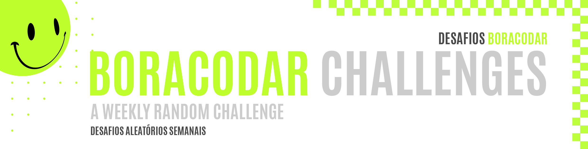
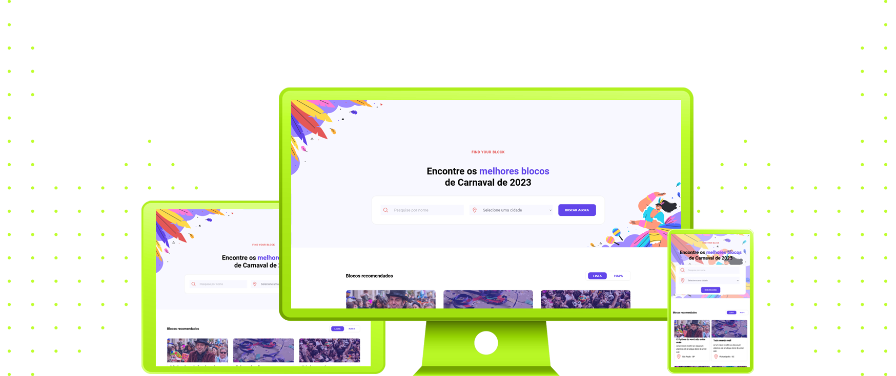

 
 

|                                                          |
| :------------------------------------------------------: |
|  |
|             **Challenge #07:** Find Your Block             |
| **Original Project:** [🌐](https://www.figma.com/community/file/1207675804423978995/Site-de-Carnaval-%E2%80%A2-Desafio-07) / **My Code:** [📄](https://github.com/malunaridev/Challenges-iCodeThis/tree/master/1-social-login) / **Live Preview:** [🌐](https://challenges-ict-social-login.vercel.app/)

 
 

 

This is the first challenge I've build for boraCodar! It was, actually, my first fullscreen project, and I remember I couldn't even sleep thinking about how to build the cards. I was excited, hyped, and I was falling in love with coding at the time, like still happens this days.

##### Esse foi o meu primeiro desafio do boraCodar! Na verdade, foi o meu primeiro projeto de tela cheia, sem ser componente, e eu lembro que eu mal consegui dormir pensando em como construiria os cards. Eu fiquei muito animada, hypada, e foi um dos marcos da minha paixão por código.

 
 
 

 

- HTML
- CSS

 
 
 

 

| Validator                                                                        |                     Passed                     |
| -------------------------------------------------------------------------------- | :--------------------------------------------: |
| [Markup Validation Service](https://validator.w3.org/) - <em>w3.org</em>         |  |
| [CSS Validation Service](https://jigsaw.w3.org/css-validator/) - <em>w3.org</em> |  |

 
 
 

 

As my first fullscreen project, I was really excited to learn how I could fit my old knowledge and match it with the new one. I did my best, but I revisited my code ahd changed some mistakes I've made as a begginner, like using id multiple times, for example. But mostly I think I did a great job with it, knowing much less than now.

##### Como o meu primeiro projeto em tela cheia, eu estava muito animada em saber como o meu conehcimento antigo poderia se encaixar com o novo. Eu fiz o meu melhor, ams eu revisitei o meu código e mudei algumas coisas que havia errado como iniciante, como usar a mesma id várias vezes, por exemplo. Mas acredito que, em grande parte, eu fiz um bom trabalho com o que sabia na época, que era bem menos do que hoje.

 
 
 

